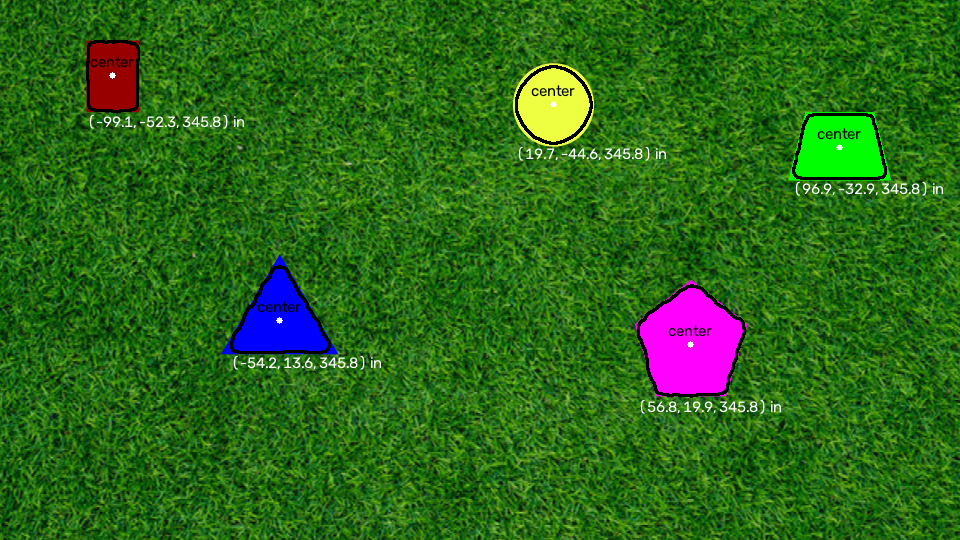
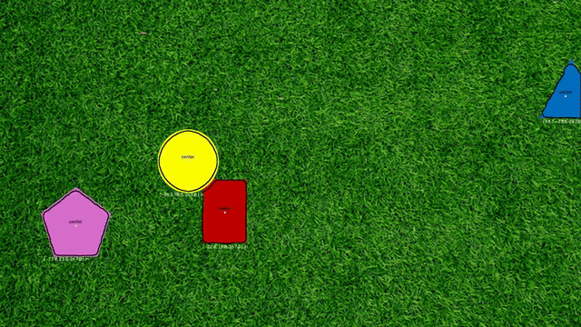
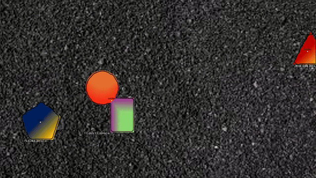

# PennAiR Software Challenge

This is the repository of my submission for the PennAiR software challenge

## Overview
This project detects shapes against varying backgrounds using local texture variance rather than color. Annotations are made either on a singular image or frames of the video, reporting the center of the shape, as well as 3D position (in inches) below the shape.

## Results
Part 1 Result:


Part 2 Result:
[](media/output/pennair_video_annotated.mp4)

Part 3 Result:
[](media/output/pennair_video_2_annotated.mp4)


## Approach
The marker shapes and background differ in texture and color, with the former being a more reliable form of measurement to use as a basis for the algorithm. The backgrounds themselves, grass and gravel, have high frequency, as the adjacent pixels vary in colors. The interior of the shape is smoother in comparison. This was taken into account when desigining the algorithm, which computes local variance over a small window before smoothing the variance map over a larger window and setting a threshold with Otsu to get a smooth vs. textured mask. The contours of the smooth regions are the shapes. There is no dependency on color, which is why the algorithm can handle media with green grass and gray backgrounds, as well as the shapes without new configurations for each unique input. The pixel-denominated parameters (i.e. kernel size) are denoted as fractions of the frame width, so the parameter configuration can cover images/videos of varying resolutions. 

More notes regarding the specifics of the algorithm can be found in md files in the docs folder.


## Repository layout

```
src/shape_detector/
    variance.py     local variance map, Var(X) = E[X^2] - E[X]^2
    detector.py     mask construction, contour filtering, detect_shapes()
    geometry.py     pinhole projection, reference-circle selection, depth and 3D coords
    visualize.py    draws outlines, centroids and coordinate labels
scripts/
    run_static.py   one image in, annotated image out
    run_video.py    one video in, annotated video out (streamed frame by frame)
ros2_ws/src/
    pennair_msgs/   custom message definitions (ament_cmake)
    pennair_vision/ publisher and detector nodes, launch file (ament_python)
docs/               design notes for each part
media/
    input/          provided source media (not committed - see Setup)
    output/         annotated results
    preview/        GIF previews used in this README
```

## Setup

Python 3.10 or newer.

```bash
git clone https://github.com/<username>/<repo>.git
cd <repo>

python3 -m venv .venv
source .venv/bin/activate

pip install -r requirements.txt
pip install -e .
```

`pip install -e .` installs `shape_detector` in editable mode so the scripts can
import it from anywhere in the project.

The provided media is not committed to keep the repository small. Download the
image and both videos from the challenge document and place them in
`media/input/`:

```
media/input/pennair_static_image.png
media/input/pennair_video.mp4
media/input/pennair_video_2.mp4
```

ROS 2 is only needed for Part 5 and is handled separately in Docker - see below.

## Running the pipeline

Each script takes a bare filename, resolved against `media/input/`, and writes
to `media/output/<name>_annotated<ext>`.

```bash
# Part 1 - static image
python scripts/run_static.py pennair_static_image.png

# Part 2 - grass video
python scripts/run_video.py pennair_video.mp4

# Part 3 - gravel background, gradient-filled shapes
python scripts/run_video.py pennair_video_2.mp4
```

Part 4 (3D localization) is not a separate command. Depth and camera-frame
coordinates are computed inside both scripts whenever a valid reference circle
is visible, and drawn beneath each shape in inches.

The same configuration is used for all three inputs. There are no per-video
parameter sets and no branching on filename or resolution.

## ROS 2

The pipeline is also exposed as a two-node ROS 2 graph: `image_publisher`
streams frames on `camera/image_raw`, and `detector_node` subscribes, runs the
detector, and publishes `pennair_msgs/ShapeDetectionArray` on
`shapes/detections`.

ROS 2 Jazzy runs in Docker. From the project root:

```bash
docker run -it --name pennair -v "$PWD":/work -w /work osrf/ros:jazzy-desktop bash
```

First time inside the container:

```bash
apt update && apt install -y python3-opencv python3-pip

echo 'source /opt/ros/jazzy/setup.bash' >> ~/.bashrc
echo 'export PYTHONPATH=/work/src:$PYTHONPATH' >> ~/.bashrc
source ~/.bashrc

cd /work/ros2_ws
colcon build --symlink-install
source install/setup.bash
```

Run the graph:

```bash
ros2 launch pennair_vision detection.launch.py \
  video_path:=/work/media/input/pennair_video.mp4
```

Inspect it from a second shell into the same container:

```bash
docker exec -it pennair bash
source /work/ros2_ws/install/setup.bash

ros2 topic list
ros2 topic hz /shapes/detections
ros2 topic echo /shapes/detections --once --truncate-length 5
```

Re-enter the container later with `docker start -ai pennair`. On Apple silicon
these images are amd64 and run under emulation, so builds are slow; add
`--platform linux/amd64` to the `docker run` to make that explicit.

## Design notes

The reasoning behind each part, including the measurements that motivated each
decision and the approaches that were tested and discarded:

- [Detection algorithm](docs/detection_algorithm_report.md) - why texture rather than colour, the variance computation, and why Otsu needed a log transform to work here
- [Failure analysis](docs/failure_analysis_report.md) - generalizing to the gravel background: the false positives, the filters that did nothing, and the one that worked
- [3D localization](docs/3d_coord_report.md) - pinhole model, depth from a known radius, the clipped-circle bug, and error propagation
- [ROS 2 design](docs/ros2_report.md) - node split, message design, and measurements

